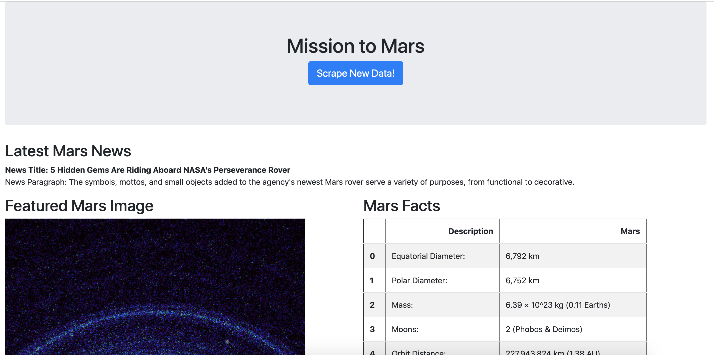

# web-scraping-challenge

## Background

In this assignment, I've built a web application that scrapes various websites for data related to the Mission to Mars and displays the information in a single HTML page.

## Process

### Step 1 - Scraping

- Completed initial scraping using Jupyter Notebook, BeautifulSoup, Pandas, and Requests/Splinter.

- Created a Jupyter Notebook file called mission_to_mars.ipynb and used this to complete all scraping and analysis tasks.

**NASA Mars News**

- Scraped the NASA Mars News Site and collected the latest News Title and Paragraph Text. Assigned the text to variables.

**JPL Mars Space Images - Featured Image**

- Used splinter to navigate the site and find the image url for the current Featured Mars Image and assigned the url string to a variable called featured_image_url.

**Mars Facts**

- Used Pandas to scrape the table containing facts about the planet including Diameter, Mass, etc.

- Used Pandas to convert the data to a HTML table string.

**Mars Hemispheres**

- Saved both the image url string for the full resolution hemisphere image, and the Hemisphere title containing the hemisphere name. Used a Python dictionary to store the data using the keys img_url and title.

- Appended the dictionary with the image url string and the hemisphere title to a list. This list contains one dictionary for each hemisphere.
---
### Step 2 - MongoDB and Flask Application

- Used MongoDB with Flask templating to create a new HTML page that displays all of the information that was scraped from the URLs above.

- Converted Jupyter notebook into a Python script called scrape_mars.py with a function called scrape that executed all of the scraping code from above and returned one Python dictionary containing all of the scraped data.

- Created a route called /scrape that imported scrape_mars.py script and called scrape function.

- Stored the return value in Mongo as a Python dictionary.

- Created a root route / that queries the Mongo database and passes the mars data into an HTML template to display the data.

- Created a template HTML file called index.html that takes the mars data dictionary and displays all of the data in the appropriate HTML elements.
---
## Results

**Below are screenshots of the final application.**

*Top Half*

*Bottom Half*

